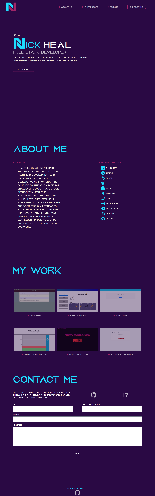

# Nick Heal's Portfolio

Welcome to my professional portfolio repository. This space showcases my journey as a Full Stack Developer with a focus on both the front and back end of web development. This portfolio site offers a glimpse into my skills, projects, and the professional path I have carved in the tech world.

## Table of Contents

- [Screenshot and Deployed Link](#screenshot-and-deployed-link)
- [Features](#features)
- [Getting Started](#getting-started)
- [Project Structure](#project-structure)
- [Development](#development)
- [Technology Used](#technology-used)
- [Acknowledgements](#acknowledgements)
- [License](#license)

## Screenshot and Deployed Link


[Visit the Deployed App](https://654d417584fa970008e94a03--magnificent-chaja-4929ce.netlify.app/)

## Features

- **Interactive Experience**: Leveraging React and Framer Motion to create dynamic, responsive user interfaces.
- **Responsive Design**: Ensures an optimal viewing experience across a wide range of devices using Tailwind CSS and Flowbite.
- **Dynamic Contact Form**: Implements EmailJS for a live, functional contact form.
- **Portfolio Showcase**: Detailed modals for each project featured in the MyWork section.
- **SEO Optimized**: Integration of React Helmet for SEO.

## Getting Started

These instructions will get you a copy of the portfolio up and running on your local machine for development and testing purposes.

1. Clone the repo:

   ```bash
   git clone https://github.com/NickUCLA/Nick-Heal-Portfolio.git
   cd nick-heal-portfolio
   ```

2. Install NPM packages:

   ```bash
   npm install
   ```

## Project Structure

The application's main components are organized as follows:

- `NavBar`: The navigation component that allows users to easily navigate through the portfolio.
- `Hero`: The introductory section showcasing Nick Heal's unique value proposition.
- `About`: A section providing insight into Nick Heal's professional background and skills.
- `MyWork`: A portfolio gallery with modals displaying detailed information for each project.
- `Contact`: A section for potential clients or employers to reach out.

## Development

To start the development server:

```bash
npm run dev
```

Visit `http://localhost:3000/` to view the app. The page will reload if you make edits.

## Technology Used

### Frontend Dependencies

- **@emailjs/browser:** Version 3.11.0 - A JavaScript library for sending email directly from the client-side.
- **@fortawesome/fontawesome-svg-core:** Version 6.4.2 - FontAwesome SVG icon library core.
- **@fortawesome/react-fontawesome:** Version 0.2.0 - React component for FontAwesome icons.
- **@headlessui/react:** Version 1.6.6 - A set of unstyled UI components for building accessible web applications.
- **emailjs-com:** Version 3.2.0 - A JavaScript library for sending email using various email services.
- **flowbite:** Version 1.5.1 - A UI framework for building modern web applications.
- **flowbite-react:** Version 0.6.4 - React integration for the Flowbite UI framework.
- **react:** Version 18.2.0 - A JavaScript library for building user interfaces.
- **react-dom:** Version 18.2.0 - ReactDOM for rendering React components into the DOM.
- **react-helmet:** Version 6.1.0 - A React library for managing the document head of your application.
- **sharp:** Version 0.30.7 - A fast and efficient image processing library for Node.js.
- **sweetalert2:** Version 11.4.26 - A beautiful, responsive, and customizable replacement for JavaScript's alert.

### Development Dependencies

- **@types/react:** Version 18.0.28 - TypeScript type definitions for React.
- **@vitejs/plugin-react:** Version 4.0.0 - Vite plugin for React development.
- **autoprefixer:** Version 10.4.16 - A PostCSS plugin to parse CSS and add vendor prefixes.
- **eslint:** Version 8.38.0 - A JavaScript linter tool.
- **eslint-plugin-react:** Version 7.32.2 - ESLint plugin for React-specific linting rules.
- **eslint-plugin-react-hooks:** Version 4.6.0 - ESLint plugin for React Hooks linting rules.
- **eslint-plugin-react-refresh:** Version 0.3.4 - ESLint plugin for React Refresh.
- **postcss:** Version 8.4.14 - A tool for transforming styles with JavaScript plugins.
- **postcss-import:** Version 15.1.0 - PostCSS plugin for importing stylesheets.
- **tailwindcss:** Version 3.3.5 - A utility-first CSS framework for building responsive web designs.
- **vite:** Version 4.3.2 - A fast build tool and development server for modern web applications.
- **vite-plugin-windicss:** Version 1.9.1 - Vite plugin for WindiCSS, a utility-first CSS framework for rapid UI development.

## Acknowledgements

This portfolio is made possible by the various open-source projects and libraries it depends on. Special thanks to everyone who supports the development and maintenance of these tools.

## License

Distributed under the MIT License. See `LICENSE` for more information.
